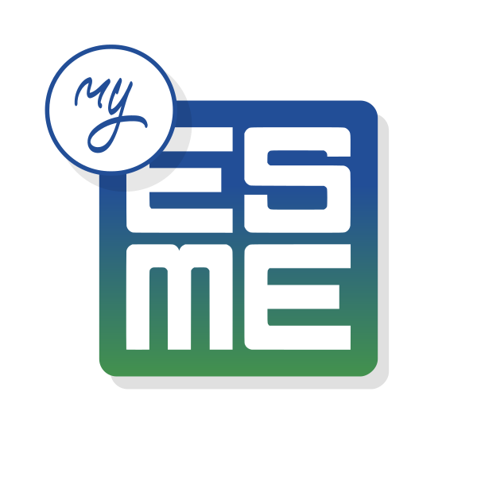

# myESME



myESME is an Android application designed for students of the ESME engineering school. The app provides a seamless way to access essential information and services, including:

- Viewing marks and results.
- Checking schedules.
- Staying updated on events.
- Exploring a map of useful points around the campus and school rooms.

## Features

- **Marks and Results**: Easily track your academic performance.
- **Schedule**: View your class schedule in one place.
- **Events**: Stay informed about upcoming school events.
- **Campus Map**: Navigate the campus with a map of important locations.

## Getting Started

### Prerequisites

- Android Studio installed on your system.
- Java Development Kit (JDK) 8 or higher.
- Gradle (comes bundled with Android Studio).

### Installation

1. Clone the repository:
    ```bash
    git clone https://github.com/sudrimaker/myESME.git
    ```
2. Open the project in Android Studio.
3. Sync the Gradle files to download dependencies.
4. Build and run the app on an emulator or physical device.

## Design

The app is built using **Jetpack Compose** and follows the **Material 3 Design Guidelines** for a modern and intuitive user experience. The design mockups are available on [Figma](https://www.figma.com/proto/cdCIIzmVQeeSu2CBmrq8eF/myESME?node-id=112-6419&p=f&t=IDunITnRMJAMrgs4-1&scaling=min-zoom&content-scaling=fixed&page-id=0%3A1&starting-point-node-id=112%3A6419).

## Built With

- **Jetpack Compose**: Modern toolkit for building native UI.
- **Material 3**: Latest design system for Android apps.
- **Android SDK**: Core framework for building Android apps.
- **Gradle**: Dependency management and build automation.

## Project Background

This project was initiated in 2025 as part of the Innovation Course at ESME Lille. The goal was to create a practical and user-friendly application to enhance the daily lives of students by integrating essential academic and campus-related services into a single platform.

## Contributing

Contributions are welcome! Please follow these steps:

1. Fork the repository.
2. Create a new branch for your feature or bug fix.
3. Commit your changes and push the branch.
4. Submit a pull request for review.

## License

This project is licensed under the MIT License. See the [LICENSE](LICENSE) file for details.

## Contact

For any questions or feedback, please contact the development team at `myesme@sudrimaker.fr`.
